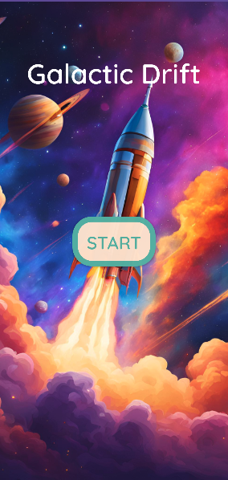
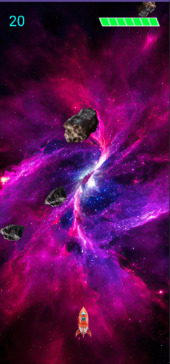
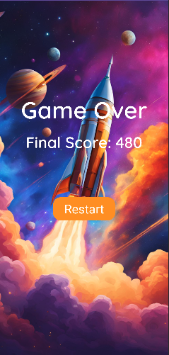

# Galactic Drift

## Overview
**Galactic Drift** is an endless dodge-and-collect game set in a distant future where humanity’s final space colony hovers on the brink of destruction. Players pilot a sentient spaceship, defending the colony against waves of asteroids and comets. Earn points by avoiding hazards, and gain extra lives by dodging multiple comets in a row.

---

## Screenshots

### Start Page

### Main Gameplay

### Game Over Screen

*(If the images don’t appear, confirm the filenames and folder paths are correct.)*

---

## Game Design Document

### Backstory
Far in the future, humanity’s final space colony hovers on the brink of destruction. In **Galactic Drift**, you control a highly advanced sentient spaceship built to defend the colony from an onslaught of cosmic threats. Asteroids and comets fill the galaxy's edge, threatening to breach the colony’s defences. As the colony’s final line of protection, the spaceship’s mission is to navigate through hazardous conditions, intercept drifting resources, and shield the colony from incoming dangers.

### Gameplay

#### Gameplay Mechanics
- **Spaceship Movement**
  - Horizontal Control: Tap or drag to move left or right.
  - Vertical Scrolling: comets/asteroids move downward.
  - Collision Detection: Hits with asteroids or comets reduce the spaceship’s health.

- **Score and Resource Collection**
  - Each hazard safely avoided grants 10 points.

- **Comet Logic**
  - **Random Comet Speed & Type**: Each comet’s velocity and sprite is chosen randomly.
  - **Random Rotation**: Comets rotate at randomly assigned speeds, making each obstacle visually distinct.
  - **Maximum of 8 Comets**: Up to 8 comets can exist on-screen simultaneously.

- **Life Recovery**
  - Every 10 consecutive comets avoided grants +1 life (if not at maximum health).
  - Any collision resets this consecutive streak to zero.

### Game Flow
1. **Start Page**  
   - The title screen welcomes the player. Tapping the blinking “Start” begins the main game loop.

2. **Main Gameplay**  
   - Player moves the spaceship horizontally (via tap or hold).
   - Comets spawn randomly at the top, moving downward.
   - The player accumulates points by avoiding collisions.
   - Every 10 consecutive comets avoided yields +1 life (if under the max).

3. **Game Over**  
   - Triggered if spaceship health depletes to zero.
   - The results screen displays total points and a “Restart” button.

4. **Restart**  
   - The player returns to the game immediately, resetting scores and comets.

### Rules & Victory Conditions
- **Rules**:
  1. Spaceship health must remain above zero to keep playing.
  2. The player can move only along the horizontal axis (by default).
  3. Scoring is continuous, no upper limit.
  4. A streak of 10 successfully dodged comets grants +1 life (if not already at max).

- **Victory**:  
  - In endless mode, the main goal is achieving the highest possible score.

- **Failure Condition**:  
  - Health depletes to zero → Spaceship destroyed → Game Over screen.

---

## Installation and Running
1. Clone or download this repository.
2. Open **GalacticDrift** in Android Studio.
3. Build and run on your device or Android emulator.

---

## License
*(Include your license text here, if applicable.)*
